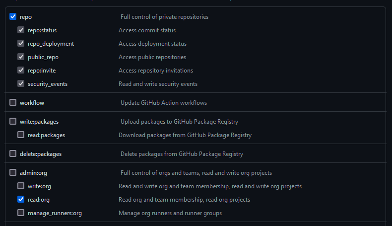
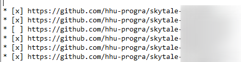
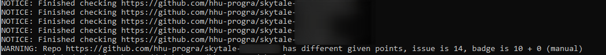

# PrograCorrectionCheck

A tool to quickly check if all the submissions assigned to oneself for the "Programming" module have been corrected.

## Setup and Requirements

- Python
  - package *requests*

    Can be installed by `python -m pip install -r requirements.txt`

- Github API Token with the following permissions
  - repo
  - read:org

To create a token, login into GitHub > Settings > Developer settings > Personal access tokens > Tokens (classic) > Generate new token > (classic)



For usage you need to provide your GitHub user name and token by either

- setting the environment variables `GITHUB_USERNAME` and `GITHUB_TOKEN`
- or by renaming the given file `settings.example.py` to `settings.py` and then adjusting the variables in the file

## Usage

This script parses an file with given repositories and checks their status. The given file path is passed as argument.

```bash
python check.py FILE
```

The file must have the original format after the assignment, only lines starting with `*` are checked:



The tool checks if the given points match the ones from the badge, if not, a warning is issued.



Since there are tasks where the badge is not the final score (for example, manual corrections) there are the following additional arguments. If those are used it is advised to check only the repositories for this specific task.

**-m** Points

For tasks that have a manual correction part, the maximum points for the manual task part can be handed over by this.

Example: a task has 8 points, 5 for the code (means the badge on GitHub shows x/5 points) and 3 for whatever answers, then the correct call would be:

```bash
python check.py FILE -m 3
```

**-b** Points

Overwrites the points of the badge, so of course no comparison of the points of the badge with the given points is possible, it is assumed at each submission, the maximum score was reached. Useful for the ship task as an example.

```bash
python check.py FILE -b 5
```

## License

*Begin license text.*

------

Copyright 2022 Jan Thilo Savary

Permission is hereby granted, free of charge, to any person obtaining a copy of this software and associated documentation files (the  "Software"), to deal in the Software without restriction, including  without limitation the rights to use, copy, modify, merge, publish,  distribute, sublicense, and/or sell copies of the Software, and to  permit persons to whom the Software is furnished to do so, subject to  the following conditions:

The above copyright notice and this permission notice shall be included in all copies or substantial portions of the Software.

THE SOFTWARE IS PROVIDED "AS IS", WITHOUT WARRANTY OF ANY KIND,  EXPRESS OR IMPLIED, INCLUDING BUT NOT LIMITED TO THE WARRANTIES OF  MERCHANTABILITY, FITNESS FOR A PARTICULAR PURPOSE AND NONINFRINGEMENT.  IN NO EVENT SHALL THE AUTHORS OR COPYRIGHT HOLDERS BE LIABLE FOR ANY  CLAIM, DAMAGES OR OTHER LIABILITY, WHETHER IN AN ACTION OF CONTRACT,  TORT OR OTHERWISE, ARISING FROM, OUT OF OR IN CONNECTION WITH THE  SOFTWARE OR THE USE OR OTHER DEALINGS IN THE SOFTWARE.

------

*End license text.*

------
